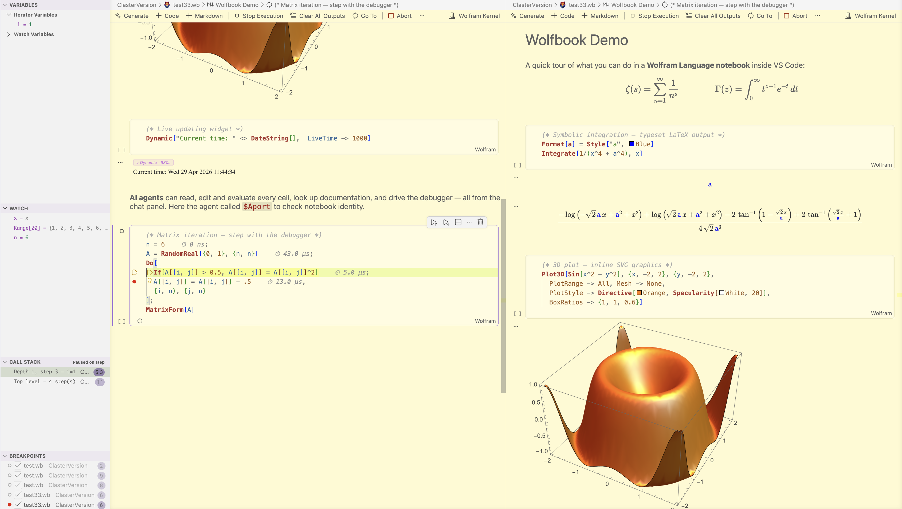
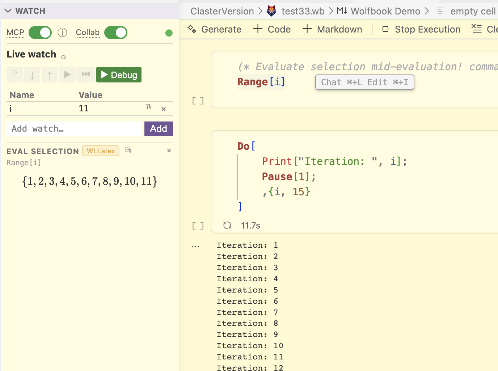
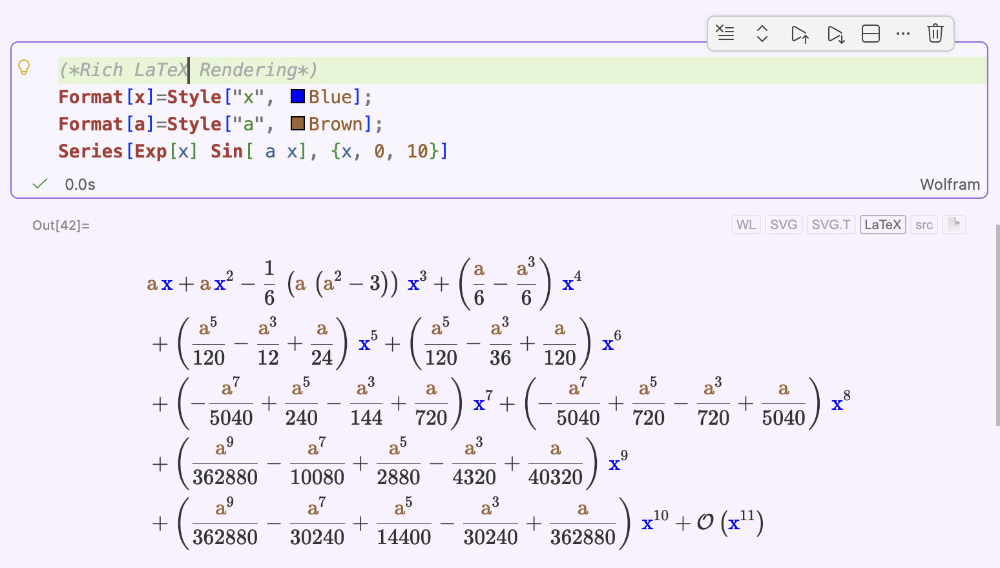
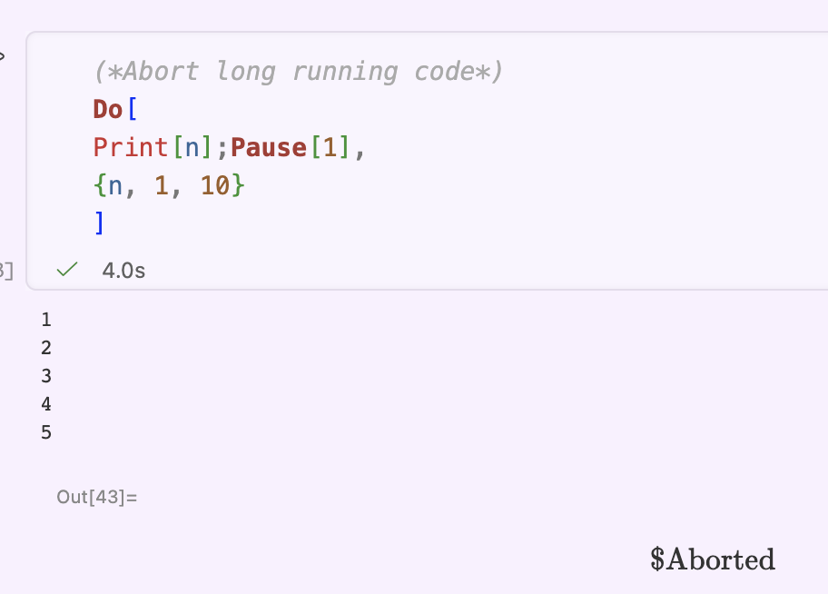
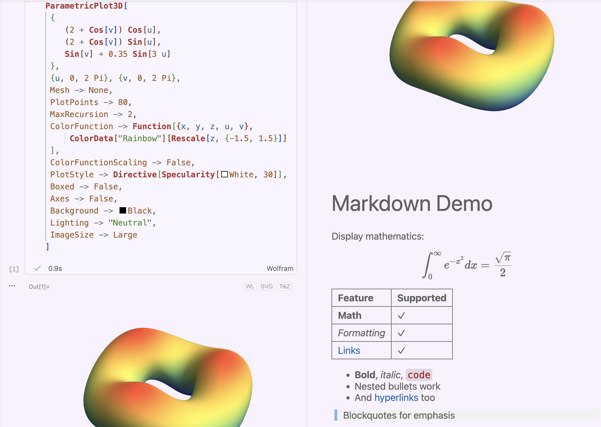
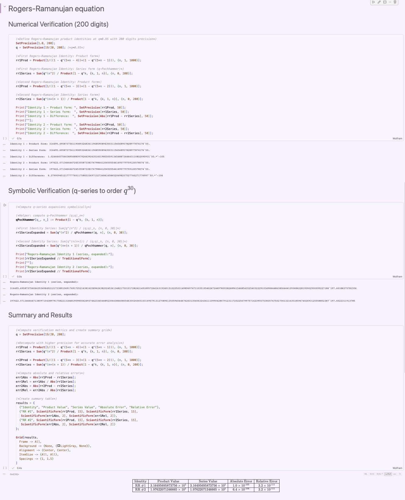

# Wolfbook — AI-Friendly Wolfram Language Notebook

  

  <a href="https://github.com/vanbaalon/wolfbook/blob/main/docs/getting-started.md">Get Started</a> ·
  <a href="https://github.com/vanbaalon/wolfbook/blob/main/docs/features.md">Features</a> ·
  <a href="https://github.com/vanbaalon/wolfbook/blob/main/docs/ai-integration.md">AI Integration</a> ·
  <a href="https://github.com/vanbaalon/wolfbook/blob/main/docs/mcp-and-agent-tools.md">MCP & Agent Tools</a> ·
  <a href="https://github.com/vanbaalon/wolfbook/blob/main/docs/using_cline.md">Using Cline</a> ·
  <a href="https://github.com/vanbaalon/wolfbook/blob/main/docs/deepseek-copilot.md">DeepSeek + Copilot</a> ·
  <a href="https://github.com/vanbaalon/wolfbook/blob/main/docs/presentations.md">Presentations (.wslide)</a> ·
  <a href="https://github.com/vanbaalon/wolfbook/blob/main/docs/oberon-agent.md">Oberon Agent 🧪</a> ·
  <a href="https://github.com/vanbaalon/wolfbook/blob/main/docs/best-practices.md">Best Practices</a> ·
  <a href="https://github.com/vanbaalon/wolfbook/blob/main/docs/wb-functions.md">WB Functions</a> ·
  <a href="https://github.com/vanbaalon/wolfbook/blob/main/README.md#citing-wolfbook">Citing</a>

Wolfbook is a Mathematica notebook frontend for VS Code. It lets you create, edit and run Wolfram Language notebooks using a local Wolfram Engine or Mathematica kernel — with rich LaTeX and graphics output, a live kernel that AI agents can call, and plain-text notebooks that work with Git.

  

---

## Why Wolfbook?

- A real Mathematica notebook inside VS Code, not just syntax highlighting
- Works with **Wolfram Engine** (free) or **Mathematica**
- Plain-text `.wb` / `.vsnb` notebooks — **diffable in Git**, readable by AI tools
- Rich math output: **LaTeX / KaTeX**, **SVG / PNG graphics**,  **TikZ**
- **Live kernel access for AI agents** — Copilot, Claude Code, Codex, MCP-compatible tools
- **Mid-evaluation abort**, **Dynamic[]** widgets, debugger and watch panel
- Open source, Apache 2.0

---

## Wolfbook vs other Wolfram/Mathematica VS Code extensions

| Feature | Wolfbook | Official Wolfram extension | Wolfram Language Notebook |
|---|---|---|---|
| Wolfram Language syntax highlighting | ✓ | ✓ | ✓ |
| Mathematica-style notebook UI | ✓ | basic | ✓ |
| Live Wolfram kernel via WSTP | ✓ | — | wolframscript |
| Rich LaTeX / KaTeX rendering | ✓ | — | partial |
| Inline SVG / PNG / TikZ graphics | ✓ | static | basic |
| Mid-evaluation abort | ✓ | — | — |
| Dynamic[] widgets | ✓ | — | — |
| AI agents can evaluate cells (MCP / Copilot) | ✓ | — | — |
| Plain-text notebook format (Git-friendly) | ✓ | ✓ | ✓ |
| Open source | ✓ | ✓ | ✓ |

---

## Screenshots

*Live watch of variables and mid-evaluation evaluate-selection feature — inspect expressions without Print statements, all while the kernel is running.*

*Symbolic Mathematica output typeset with LaTeX via KaTeX. Adaptive line-breaking and matrix paging make even huge expressions readable.*

*An AI agent using Wolfbook's MCP tools — calling `$Aport`, looking up documentation, evaluating cells in the live Wolfram kernel.*

*An AI agent (Claude Code / Copilot / MCP-compatible) evaluating cells and inspecting results in a live Wolfram kernel.*

*AI agents can read your notebook content in an AI-friendly format, assist you in writing code, or solve mathematical problems from start to end with full numerical and analytic verification — producing a clean notebook for your inspection, debugging errors, and summarizing main findings. You can then export results to your LaTeX documents with ease, either using AI agents or manually.*

---

## What You Get

### A proper notebook in VS Code

- `.wb` files with code cells and Markdown cells (with full LaTeX math via KaTeX)
- Symbolic results rendered as typeset mathematics with line-broken LaTeX — not plain text
- Graphics (plots, `Graphics[…]`) rendered as SVG or PNG inline
- Per-cell output format switching: WL / SVG / LaTeX / MathML / TikZ
- `Dynamic[expr]` widgets that update live while the kernel runs
- Abort the kernel without losing your kernel context, or restart with a clean kernel with one click — exactly like in Mathematica, but unique among VS Code notebook extensions
- Escape-mode Greek entry: type `\[Alpha]`, `\[Beta]`, `\[Gamma]` and they get converted into symbols, or use [escape]a[escape] etc.
- Watch any expression continuously; evaluate any selection mid-computation

### VS Code IDE features — free

- Split view: open two notebooks side by side
- Multi-cursor: rename all occurrences of a symbol at once
- Step-by-step debugger: set breakpoints, step over/into loops, inspect variables
- Live Watch Panel: monitor expressions across evaluations without Print statements
- Full git integration: diff, blame, branch — works because `.wb` is plain text

### AI that actually knows your notebook

Wolfbook exposes your live kernel and notebook contents to AI agents via purpose-built tools. GitHub Copilot in Agent mode can, for example:

- Read all cells and their outputs (`#wolfbookContext`)
- Evaluate any expression in the live kernel (`#wolfbookEval`)
- Look up Wolfram documentation without a browser (`#wolfbookLookup`)
- Insert, edit, and delete cells (`#wolfbookInsert`, `#wolfbookEdit`, `#wolfbookDelete`)
- Drive the step-through debugger autonomously (`#wolfbookDebug`)
- Query the kernel state — what symbols are defined, what are their values (`#wolfbookState`)

The same tools are exposed as an **MCP (Model Context Protocol) server**, so any MCP-compatible AI agent — Claude Code, Codex, and others — can use them too. See [MCP & Agent Tools](docs/mcp-and-agent-tools.md) for details.

### Presentations built in your notebook

Wolfbook includes a `.wslide` presentation format: JSON-based slides rendered via Reveal.js inside VS Code, with LaTeX math, live Wolfram Language eval blocks, and the same btl math renderer as the notebook. The entire slide format is editable by AI agents via 12 dedicated MCP tools. See [Presentations](docs/presentations.md). Drop your pictures and a bit of text and get a full slide deck in seconds. Refine it with AI and create a masterpiece.

**Reworked in this release:** the slide editor has been substantially reworked — a cleaner canvas with proper selection, alignment and arrange tooling, and a redesigned side panel. It now has **AI editing built into the editor itself**: select any block (or several) and press **⌘K** to say what you want — *"tidy this"*, *"make these equal width"*, *"turn into 3 bullets"* — and the assistant proposes concrete changes you accept or reject before anything is written. Deterministic one-click actions for the common tidy-ups need no model at all.

### 🧪 Experimental: the Oberon research agent

> **This is an experimental preview and it is off by default.** Oberon requires
> *your own* third-party LLM API key, spends real money per run, writes files
> into your workspace, and its commands and settings will change between
> releases. With no API key configured it never runs and nothing leaves your
> machine. Nothing else in Wolfbook depends on it — ignore this section entirely
> and the notebook, kernel and slide features work exactly as before.

Wolfbook ships an early preview of **Oberon**, an autonomous research agent that lives inside the extension. Where the tools above let an AI *assist* you, Oberon takes a brief and does the work: it plans the calculation, probes the live kernel, records the steps that survive, compiles them into a clean notebook, and then **restarts the kernel and re-runs that notebook from scratch** to verify it. The model is allowed to be wrong; the kernel is the judge.

It is also integrated with **[SkilXiv.org](https://skilxiv.org)**, a public registry of versioned, citeable, executable know-how. Oberon looks up a relevant *skill* before it starts — which on hard problems is the difference between rediscovering a method by trial and error and simply applying it — and can draft new skills from verified results for you to review and publish.

Oberon is **opt-in and off until you configure an API key**; with none set, it never runs and nothing leaves your machine. It costs real money per run (typically cents, on DeepSeek) and its interface will change between releases.

→ **[Oberon — the experimental research agent](docs/oberon-agent.md)**: what it does, how to configure providers, roles, budgets, the SkilXiv integration, and exactly what data goes where.

---

## Quick Start

**1. Install prerequisites**

- [VS Code](https://code.visualstudio.com) 1.95+ / [Antigravity](https://antigravity.ai)
- [Wolfram Engine](https://wolfram.com/engine) (free, non-commercial) or Mathematica
- Activate Wolfram Engine at [wolfram.com/engine/free-license](https://wolfram.com/engine/free-license) — requires internet once

**2. Install Wolfbook**

Wolfbook can be found in the VS Code Marketplace or on GitHub in the [Releases](https://github.com/vanbaalon/wolfbook/releases) section. Or on Antigravity's marketplace or [open-vsx.org](https://open-vsx.org/).

**3. Create your first notebook**

Create an empty file `test.wb` and open it in VS Code. The kernel starts automatically on first cell execution.

**4. Enable AI (optional but recommended)**

Install GitHub Copilot from the Extensions panel (free tier available; GitHub Education gives generous limits). Open the Copilot Chat panel (`⌃⌘I`), switch to **Agent** mode, and start asking. From our experience Claude Code in Agent mode gives the best result.

→ Full setup guide: [Getting Started](docs/getting-started.md)

---

## Architecture

Wolfbook is built around two bespoke native C++ addons:

**`mathematica-wstp-node`** — connects directly to the Wolfram kernel via the WSTP (Wolfram Symbolic Transfer Protocol) protocol. No subprocess piping, no ZeroMQ. This is what makes mid-evaluation abort, Dynamic widgets, and Dialog[] subsessions possible.

**`wolfbook-btl`** (Box-to-LaTeX) — translates Wolfram's internal `TraditionalForm` box structures to LaTeX, rendered client-side with KaTeX. About 10× faster than Wolfram's built-in `TeXForm` for complex expressions, and handles many cases TeXForm cannot. Dynamically adjusts line-breaking to fit the page width. Long expressions are paginated or can be exported in one click in `.wl` format.

Both addons are prebuilt for macOS (Apple Silicon and Intel) and Windows and bundled in the `.vsix`. Linux is under construction. You can also compile them yourself; see [Building from Source](docs/building.md).

---

## Documentation

| Document | What it covers |
|---|---|
| [Getting Started](docs/getting-started.md) | Installation, first notebook, setup checklist |
| [AI Integration](docs/ai-integration.md) | GitHub Copilot agent tools — full reference |
| [MCP & Agent Tools](docs/mcp-and-agent-tools.md) | Using Wolfbook with Claude Code, Codex, and other MCP clients |
| [Oberon Agent (experimental)](docs/oberon-agent.md) | The autonomous research agent: setup, providers, budgets, SkilXiv, privacy |
| [Features](docs/features.md) | Notebook interface, kernel control, editor, debugger, Dynamic |
| [Presentations (.wslide)](docs/presentations.md) | The AI-native slide format |
| [DeepSeek + Copilot](docs/deepseek-copilot.md) | Using DeepSeek models with VS Code Copilot |
| [Best Practices](docs/best-practices.md) | How to work effectively with the agent |
| [Building from Source](docs/building.md) | Compile the native addons, package the extension |
| [WB Functions](docs/wb-functions.md) | Custom WL functions: WBVersion, WBDirectory, WBPrint, WBInclude, WBExport, WBPrompt |

---

## Data and privacy

**Wolfbook does not collect analytics and has no telemetry of its own.** Your
notebooks, kernel session and slides stay on your machine.

Network access happens in exactly two places, both under your control:

| What | When | Where it goes |
|---|---|---|
| Wolfram kernel | Always local | Nothing leaves your machine — the kernel runs on your computer via WSTP |
| **Oberon agent** (experimental, off by default) | Only when *you* configure an API key and start a run | Your task text and code excerpts go to the LLM provider **you** chose (DeepSeek, Anthropic or OpenAI), under that provider's terms |
| **SkilXiv** skill lookup (part of Oberon) | Only during an Oberon run, when recall is enabled | A search query derived from your task. Anonymous outcome reports (did a skill help) contain no task content. Skill contributions are **never** published without your explicit review and approval |

With no Oberon API key configured, **none of the above happens** — no LLM calls,
no SkilXiv requests, nothing. To disable the SkilXiv parts while still using the
agent, set `wolfbook.oberon.recall.enabled` and
`wolfbook.oberon.recall.usageTelemetry` to `false`.

Full detail: [Oberon — data and privacy](docs/oberon-agent.md#data-and-privacy).

---

## Status and Feedback

Wolfbook is just over a month old (first release: March 2026). It works well for the use cases demonstrated at the CERN workshop, but rough edges remain. If you encounter a bug or unexpected behaviour, please **report it via the [GitHub issue tracker](https://github.com/vanbaalon/wolfbook/issues)** — include your OS, VS Code version, Wolfram Engine / Mathematica version, and a minimal code or screenshots that reproduces the problem. We will try to fix issues as quickly as possible.

Feature requests and pull requests are also very welcome.

## Citing Wolfbook

If Wolfbook supports your research, a brief mention in the acknowledgements helps us track impact and sustain development:

> *"Some computations in this work were facilitated by the Wolfbook VS Code extension (github.com/vanbaalon/wolfbook)."*

---

## Links

- GitHub: [github.com/vanbaalon/wolfbook](https://github.com/vanbaalon/wolfbook)
- WSTP addon: [github.com/vanbaalon/mathematica-wstp-node](https://github.com/vanbaalon/mathematica-wstp-node)
- Wolfram Engine (free): [wolfram.com/engine](https://wolfram.com/engine)

**Author:** Nikolay Gromov, King's College London — nikolay.gromov@kcl.ac.uk  
**License:** Apache 2.0

> Wolfbook is an independent open-source project, not affiliated with or endorsed by Wolfram Research Inc. "Wolfram", "Mathematica", and "Wolfram Language" are trademarks of Wolfram Research Inc.

## Acknowledgements 

Wolfbook was heavily inspired by and initially based on the official `vscode-wolfram` extension by Wolfram Research Inc. (Apache 2.0). The LSP client layer and kernel-finding logic originate from that project. The notebook frontend and the entire kernel backend have since been rewritten from scratch.

Special thanks to **Ruben Myers** for his help compiling the Unix build of the native binaries — the WSTP bridge and the `btl` math renderer are native addons that must be built per platform, and that work is what makes Wolfbook usable outside macOS and Windows.

